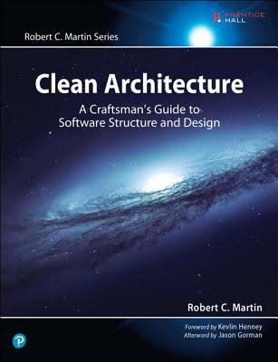
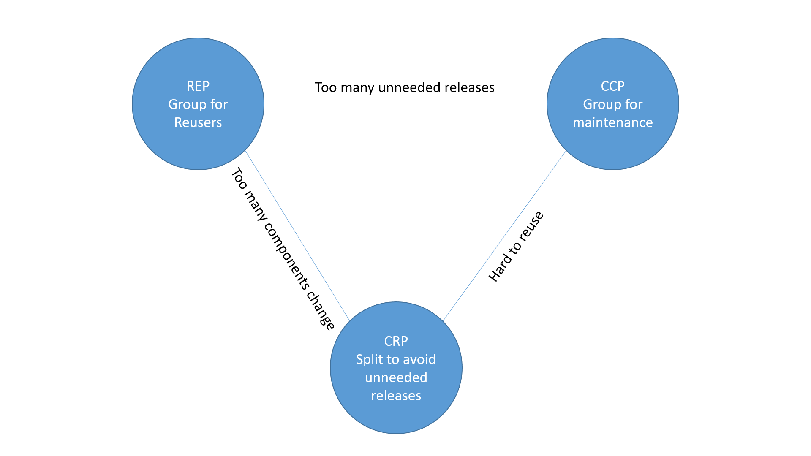
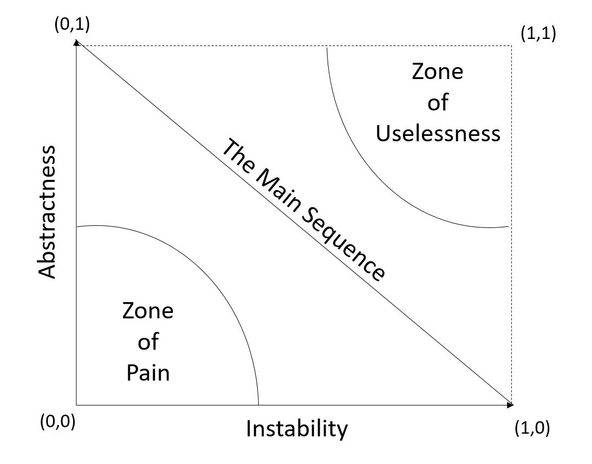

> If our designs are failing due to the constant rain of changing requirements, it is our designs that are at fault. We must somehow find a way to make our designs resilient to such changes and protect them from rotting.

> ~ Robert Cecil Martin

---

# Clean Architecture
## An overview

---

## Source
Robert Martin's Clean Architecture

<!-- .element height="400px" .element style="border: 0; background: None; box-shadow: None" -->

<!-- .element height="400px" .element style="border: 0; background: None; box-shadow: None" -->

notes:
Robert Martin's Credentials
* Author
* decades of experience as a software engineer in many diverse fields

---

## Overview
* Architecture VS Design
* Why Clean Architecture Matters
* What is Clean Architecture

notes:
The goal of this presentation is to give a very high level overview of some of the principles introduced in the book. It is not meant to be a deep dive into practical application but a taste to give you a desire to want more.

---

### Architecture VS Design

<!-- .element height="500px" .element style="border: 0; background: None; box-shadow: None" -->

notes: 
The author points out that while Architecture typically refers to High level while design is typically used in reference to lower level. However he suggests this differentiation is nonsense they are the same.

---

## Why Clean Does Architecture Matters?
* Cost of Poor Architecture
* The Two values

----

### Cost of Poor Architecture

<!-- .element height="500px" .element style="border: 0; background: None; box-shadow: None" -->

notes:
This is where i want to show the charts in the book about the project that after 8 release cycles the project's productivity plateau even though the number of developers on the project continues to increase.
The author points out that he has worked on projects where the architecture is clean and changes are quick to make.

----

## The Tale of two values
* Behavior
* Architecture

notes:
Behavior is what the system does
Architecture is making the system easy to change
some software developers focus on behavior without much thought to the architecture of the system. There is business value to both.

---

## What is Clean Architecture?
* Software Design Principle
    * SOLID
* Component Design Principles
    * Component Cohesion
    * Component Coupling

---

## SOLID
* Single Responsibility Principle
* Open Close Principle
* Liskov Substitution Principle
* Interface Segregation Principle
* Dependency Inversion  Principle

for a deeper dive watch: https://www.youtube.com/watch?v=_ahSBkSOyzQ

notes: try not to spend to much time on solid. Most are familiar with it be brief on this slide and the next few.

* Good architecture requires us to use good building materials. Just like if you build a building of poor materials it doesn't really matter how great the architecture is. 
These principles are expanded upon in future chapters/slides so we'll cover their architecture analog briefly.

---

## What is a Component?

notes:
* unit of deployment
* i.e. jar, gem, dlls, exe
* independently deployable and developable

---

## Component Cohesion

> how components relate

----

### The Reuse/Release Equivalence Principle
> The Granule of reuse is the granule of release

notes: Releases need to be tracked, documented, and perform notifications. Developers need to be able to make a conscious decision wether to update or not to update to a new version of a release. Components must be a cohesive group not a random collection of classes and modules.

"The fact that they share the same version number and the same release tracking, and are included under the same release documentation, should make sense both to the author and to the users."

The author says "make sense" but the next two principles help compensate for this

----

### The Common Closure Principle

> Gather together those things that change at the same times and for the same reasons. Separate those things that change at different times or for different reasons.

Notes: Release = validation, testing, code reviews. Why test the hole app when only a portion is deployed.
The single responsibility principle restated for components.
keeping changes into one component reduces the effort in releases and deploys.
"Gather together those things that change at the same times for the same reasons. Separate those things that change at different times or for different reasons"

----

### The Common Reuse Principle

> Don't Force the users of a component to depend on things they don't need.

Notes: Classes and modules that tend to be reused together belong in the same module
What classes belong and don't belong in the component
When a change occurs to a used component a change to the using component might occur. At the least revalidation of the using component has to occur even if the change to the used component doesn't affect the using component.
Interface Segregation Principle for components
Don't depend on what you don't need.

* if you have to much or to little in your component it makes it difficult to reuse
* cue large dependency that depends on everything soap box
* classes are not typically reused in isolation
 

----

### Tension diagram

<!-- .element height="400px" .element style="border: 0; background: None; box-shadow: None" -->

notes:
the three principles don't always live in harmony. A balance has to be made between them.

---

## Component Coupling

----

### The Acyclic Dependencies Principle
> Allow no cycles in the component dependency graph

notes:
components are a solution to the problem of multiple people working on the same product.
Clearwater is good at a portion of this.

----

### The Stable Dependencies Principles
> Depend in the direction of stability

> I = Fan-out / (Fan-in + Fan-out)

notes:

----

### The Stable Abstraction Principle
> A component should be as abstract as it is stable

> A = Num abstract classes / Num classes

notes:
* stable should be abstract so that stability doesn't prevent extensibility.

----

#### The Zone of Pain and Uselessness

<!-- .element height="400px" .element style="border: 0; background: None; box-shadow: None" -->

notes: continuation from the previous slide

---
### The Clean Architecture

<!-- .element  .element style="border: 0; background: None; box-shadow: None" -->

notes: what all of this is driving towards is this The clean architecture.
* Independent of frameworks
* testable
* independent of ui
* independent of database
* independent of any external agency
Not going into much more detail in this presentation partially because i haven't studied this part.
wrap up

---

## Questions / Feedback
https://www.surveymonkey.com/r/MBJP8CY
